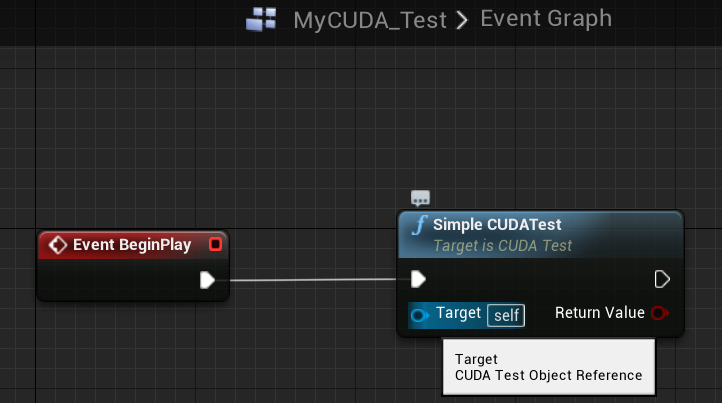
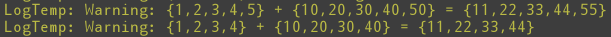

# 在 Unreal Engine 4 中使用 CUDA

本專案實作 [SCIEMENT](http://www.sciement.com/tech-blog/author/sciement/) 於 [`[C++][CUDA][UE4]CUDA関数をUnreal Engine 4で用いる`](http://www.sciement.com/tech-blog/c/cuda_in_ue4/) 一文中將自訂 CUDA 運算函式應用於 UE4 之方法。

## 開發環境

    Visual Studio 2015

    CUDA Toolkit v10.1

    Unreal Engine 4.18


## 運作方式
要在 Unreal 中使用 CUDA 做平行運算，我們必須先將各種需要的函示建成函式庫後，再將其連結至 Unreal 專案中做使用。這裡我們實作兩個簡單的向量平行化加法運算函式，第一種使用一般 C 語言陣列作為輸出入，第二種則是使用 CUDA 定義的四維向量 (int4)

## 自訂函示庫 (cuda_lib/)

### 連結函示庫
CUDATest.Build.cs
```C#
    string custom_cuda_lib_include = "CUDALib/include";
    string custom_cuda_lib_lib = "CUDALib/lib";

    PublicIncludePaths.Add(Path.Combine(poject_root_path, custom_cuda_lib_include));
    PublicAdditionalLibraries.Add(Path.Combine(poject_root_path, custom_cuda_lib_lib, "cuda_lib.lib"));

    string cuda_path = "C:/Program Files/NVIDIA GPU Computing Toolkit/CUDA/v10.2/";
    string cuda_include = "include";
    string cuda_lib = "lib/x64";

    PublicIncludePaths.Add(Path.Combine(cuda_path, cuda_include));

    //PublicAdditionalLibraries.Add(Path.Combine(cuda_path, cuda_lib, "cudart.lib"));
    PublicAdditionalLibraries.Add(Path.Combine(cuda_path, cuda_lib, "cudart_static.lib"));
```

### 使用 cuda_lib 定義所需的函式:

cuda_lib_test.h
```cpp
cudaError_t addWithCuda(int *c, const int *a, const int *b, unsigned int size, std::string *error_message);
// Helper function for using CUDA to add vectors in parallel.
cudaError_t addWithCuda2(int4 *c, const int4 *a, const int4 *b, std::string* error_message);
```

### 定義加法:

cuda_lib_test.cu

```cpp
__global__ void addKernel(int *c, const int *a, const int *b)
{
    int i = threadIdx.x;
    c[i] = a[i] + b[i];
}
```

### 配置 GPU buffer:

cuda_lib_test.cu (**addWithCuda()**)
```cpp
    // Allocate GPU buffers for three vectors (two input, one output)    .
    cudaStatus = cudaMalloc((void**)&dev_c, size * sizeof(int));
    if (cudaStatus != cudaSuccess) {
		*error_message = "cudaMalloc failed!";
        goto Error;
    }

    cudaStatus = cudaMalloc((void**)&dev_a, size * sizeof(int));
    if (cudaStatus != cudaSuccess) {
		*error_message = "cudaMalloc failed!";
        goto Error;
    }

    cudaStatus = cudaMalloc((void**)&dev_b, size * sizeof(int));
    if (cudaStatus != cudaSuccess) {
		*error_message = "cudaMalloc failed!";
        goto Error;
    }
```

### 將資料複製到 GPU buffer
cuda_lib_test.cu (**addWithCuda()**)
```cpp
    // Copy input vectors from host memory to GPU buffers.
    cudaStatus = cudaMemcpy(dev_a, a, size * sizeof(int), cudaMemcpyHostToDevice);
    if (cudaStatus != cudaSuccess) {
		*error_message = "cudaMemcpy failed!";
        goto Error;
    }

    cudaStatus = cudaMemcpy(dev_b, b, size * sizeof(int), cudaMemcpyHostToDevice);
    if (cudaStatus != cudaSuccess) {
		*error_message = "cudaMemcpy failed!";
        goto Error;
    }

    // Launch a kernel on the GPU with one thread for each element.
    addKernel <<<1, size>>>(dev_c, dev_a, dev_b);

    // Check for any errors launching the kernel
    cudaStatus = cudaGetLastError();
    if (cudaStatus != cudaSuccess) {
		*error_message = "addKernel launch failed: " + std::string(cudaGetErrorString(cudaStatus));
        goto Error;
    }
```
### 透過 GPU 執行運算
```cpp
    // Launch a kernel on the GPU with one thread for each element.
    addKernel <<<1, size>>>(dev_c, dev_a, dev_b);
```

## UE4 測試專案 (CUDATest/)
### 在 C++ class 中定義函式
CUDA_Test.h
```cpp
    UFUNCTION(BlueprintCallable, Category = "CUDATest")
	bool SimpleCUDATest();
```
### 使用自訂 CUDA 運算函式
CUDA_Test.cpp (**SimpleCUDATest()**)
```cpp
// ----- addWithCuda test -----
	const int arraySize = 5;
	const int a[arraySize] = { 1, 2, 3, 4, 5 };
	const int b[arraySize] = { 10, 20, 30, 40, 50 };
	int c[arraySize] = { 0 };
	std::string error_message;

	// Add vectors in parallel.
	cudaError_t cuda_status = addWithCuda(c, a, b, arraySize, &error_message);
	if (cuda_status != cudaSuccess) {
		UE_LOG(LogTemp, Warning, TEXT("addWithCuda failed!\n"));
		UE_LOG(LogTemp, Warning, TEXT("%s"), *FString(error_message.c_str()));
		return false;
	}
	UE_LOG(LogTemp, Warning, TEXT("{1,2,3,4,5} + {10,20,30,40,50} = {%d,%d,%d,%d,%d}"), c[0], c[1], c[2], c[3], c[4]);
```

### 於 Blueprint 中呼叫函式


### 執行結果
